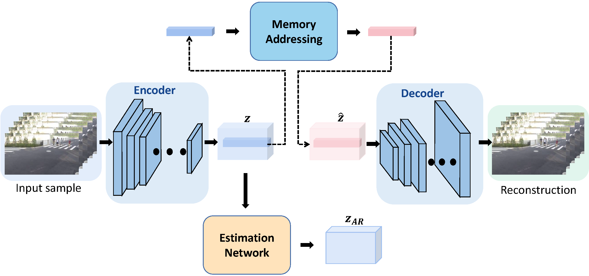
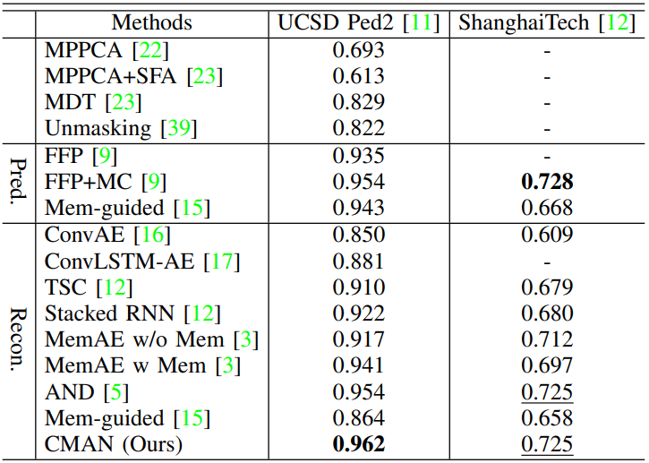
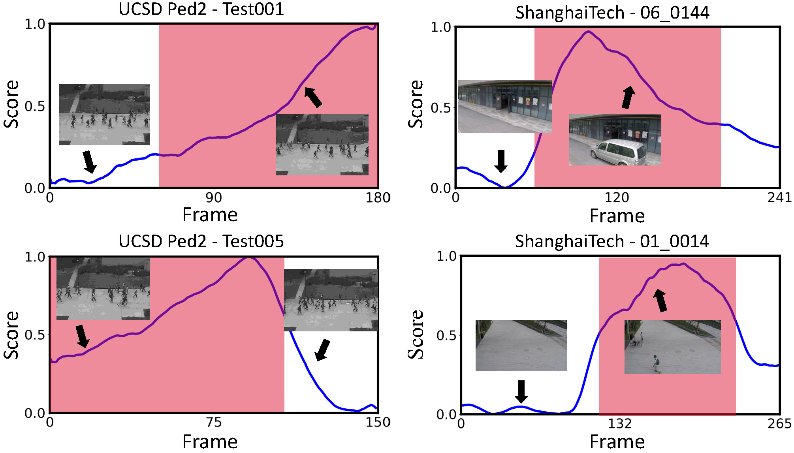
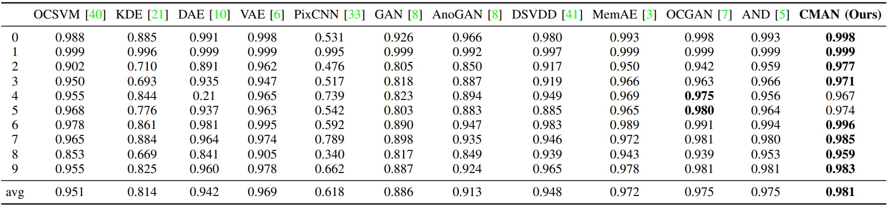
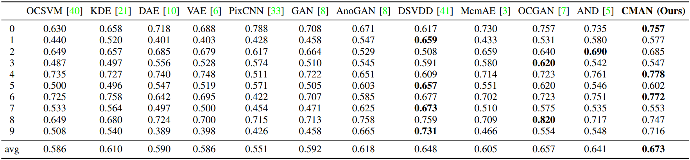
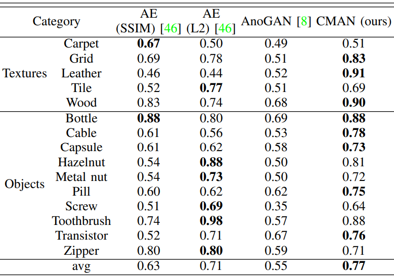

# Code_CMAN

This is the source code of our work "Cognitive Memory-Augmented Network for Visual Anomaly Detection". 



# Installation and Requirements
## Installation

We recommended the following dependencies:

+ python 3.6
+ numpy 1.16.2
+ torch 1.3.1
+ ptable 0.9.2
+ scikit-learn 0.22.2
+ tqdm 4.42.1
+ scipy 1.1.0

# Testing

## Datasets and Checkpoints
+ MNIST and CIFAR-10 will be downloaded for you by torchvision.

+ Checkpoints for mnist and cifar10 datasets are available [here](https://pan.baidu.com/s/16L9BAYLAqPESgE_MQkSgFA) (code: z9jt).

+ The folder structure of checkpoints is listed as follow.

```
  |-- checkpoints',
    |-- mem_cifar',
    |   |-- 0.pkl',
    |   |-- 1.pkl',
    |   |-- 2.pkl',
    |   |-- 3.pkl',
    |   |-- 4.pkl',
    |   |-- 5.pkl',
    |   |-- 6.pkl',
    |   |-- 7.pkl',
    |   |-- 8.pkl',
    |   |-- 9.pkl',
    |-- mem_mnist',
        |-- 0.pkl',
        |-- 1.pkl',
        |-- 2.pkl',
        |-- 3.pkl',
        |-- 4.pkl',
        |-- 5.pkl',
        |-- 6.pkl',
        |-- 7.pkl',
        |-- 8.pkl',
        |-- 9.pkl',
```

## Run!

Once your setup is complete, running tests is as simple as running `test.py`.
Usage:

```
usage: python test.py [-h] [--dataset DATASET] [--path PATH]
                      [--checkpoints CHECKPOINTS]

optional arguments:
  -h, --help  show this help message and exit
  --dataset, DATASET  The name of the dataset to perform tests. 
                      Choose among `mnist`, 'cifar' (default: None)
  --path, PATH        The file path of the dataset to perform tests.
                      (default: None)
  --checkpoints, CHECKPOINTS
                      The checkpoints path of the dataset to perform tests.
                      (default: None)
```

Example:

Testing on MNIST dataset.
```
python test.py --dataset 'mnist' --path 'dataset_path' --checkpoints 'checkpoints/mem_mnist'
```

Testing on CIFAR10 dataset.
```
python test.py --dataset 'cifar10' --path 'dataset_path' --checkpoints 'checkpoints/mem_cifar10'
```

# Results

Experimental details is explained in our paper "Cognitive Memory-Augmented Network for Visual Anomaly Detection".
We list some of the experimental results as follows.

## Video Dataset
We have performed the proposed method on video dataset. The AUC results of different methods are listed as follow:



And the examples of score results, obtained by the proposed CMAN method on UCSD Ped2 and ShanghaiTech datasets, are listed as follow:



## Image Dataset
We have also performed the proposed method on image dataset. The AUC results of different methods are listed as follows:





## Visual inspection task

We have also conducted a visual inspection experiment on the MVTec dataset, compared with stateof-the-art methods. The performance of the proposed method on visual inspection task is listed as follow:




## References
This code follows the basic structure from [Latent Space Autoregression for Novelty Detection](https://github.com/aimagelab/novelty-detection) and [memae-anomaly-detection](https://github.com/donggong1/memae-anomaly-detection).